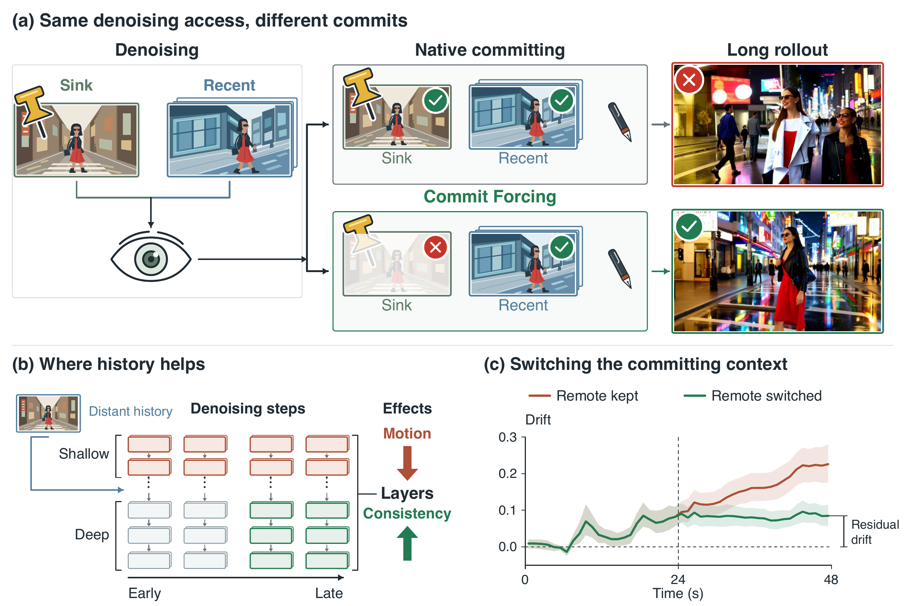
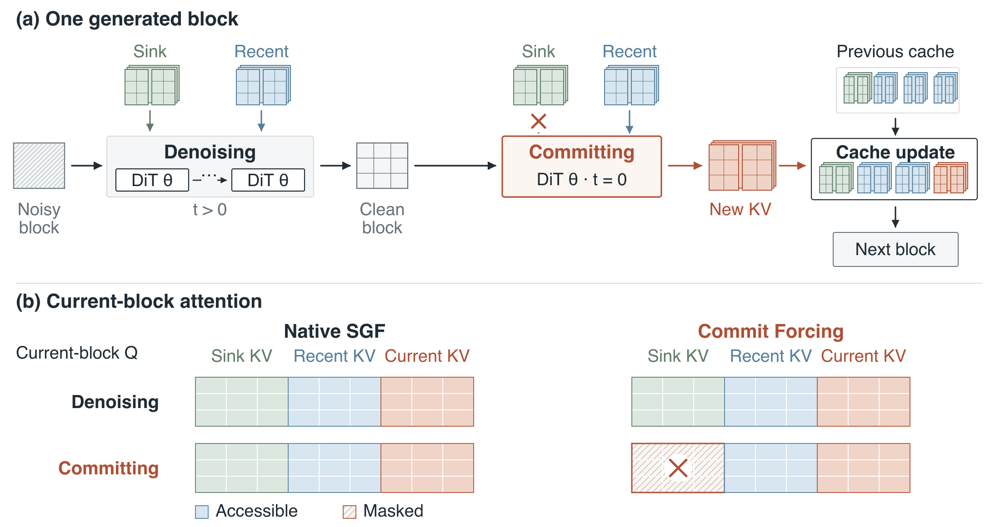
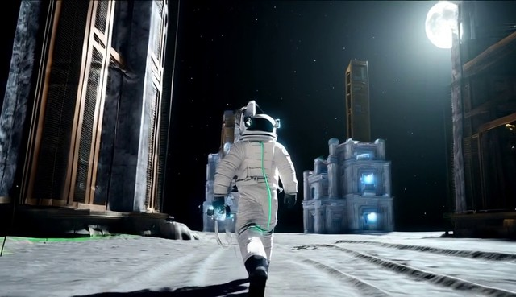

<div align="center">

<h1>What Helps Denoising Can Hurt Memory:<br>Rethinking History in Long Video Generation</h1>

**Commit Forcing: a training-free rule for what a long-video model writes into its KV cache.**

[](#news)&nbsp;
[](#supported-models)&nbsp;
[](RESULTS.md)&nbsp;
[](LICENSE)

</div>

## News

<table>
<tr><td></td><td><b>Code</b>: Commit Forcing for 8 models, the evaluation pipelines, per-video scores and the mechanism analyses</td></tr>
<tr><td></td><td><b>arXiv preprint</b></td></tr>
</table>

<p align="center">
  
</p>

<sub>Historical context has different effects when a block is denoised and when it is committed to the KV cache.</sub>

---

Block-causal video models (Self-Forcing and its successors) generate a video block by block. After the denoising
passes of a block, a **commit pass** re-encodes the clean block and writes its keys and values into the KV cache, where
every later block reads them. The context that helps denoising (an attention sink, distant history, retrieved memory,
replayed frames) writes drift into the cache when the commit pass reads it.

**Commit Forcing** leaves the denoising passes unchanged and lets the commit pass read only the current block and the
recent frames. It needs no training and no extra forward pass, and raises long-range consistency on all 8 models we
tested.

## Contributions

- **Phase-dependent context.** We identify a phase-dependent effect of the sink: it anchors denoising but can induce
  drift during committing, showing that effective denoising context need not be effective committing context.
  ([LongLive sink](analysis/longlive_sink/README.md), [commit switch](analysis/commit_switch/README.md))
- **Mechanism analysis.** We analyze historical effects across source, denoising step, layer, content, and generator,
  and use exposure and switching experiments to distinguish continued drift from persistent offsets across blocks.
  ([analyses](#mechanism-analyses))
- **Commit Forcing.** We propose training-free Commit Forcing across autoregressive pipelines, improving 60-second
  VBench Total by 0.43–1.08 points and reaching 84.72 VBench-Long Quality on SGF with RF reading.
  ([results](#results))

<p align="center">
  
</p>

<sub>In SGF, the denoising passes read the sink and the recent cache as in the base model; the commit pass at t = 0
reads the recent cache and the current block. The sink stays available to the next block's denoising.</sub>

## Results

**VBench-Long on rollf200, 60 s videos**, 200 fixed [MovieGen prompts](eval/prompts/README.md), generation seed 0.
Quality combines VBench's seven visual dimensions using its official normalization and weights.

| Model | Base | + Commit Forcing | Δ Quality | Δ Consistency |
|:---|--:|--:|--:|--:|
| SGF + RF reading | 84.42 | **84.72** | **+0.30** | **+3.35** |
| SGF | 83.58 | <ins>84.62</ins> | **+1.04** | **+4.40** |
| SGF+ | 84.23 | 84.34 | +0.12 | **+2.84** |
| Context Forcing | 82.78 | 82.91 | +0.13 | **+3.23** |
| Rolling Sink | 82.61 | 82.72 | +0.11 | **+0.67** |
| LongLive | 82.23 | 82.65 | **+0.42** | **+0.92** |
| Recency Forcing, training-free † | 82.01 | 82.47 | **+0.46** | **+3.86** |
| ID-Forcing on LongLive | 82.54 | 82.45 | −0.09 | **+2.05** |
| ID-Forcing on Self-Forcing | 82.20 | 82.44 | **+0.23** | **+2.53** |

Base: the original model. + Commit Forcing: the same weights and initial noise, with Commit Forcing (no training).
Consistency: VBench-Long's clip-to-clip subject consistency, our measure of long-range consistency.
**Bold** / <ins>underline</ins>: the two highest Quality scores in this table;
**bold Δ**: the paired 95% bootstrap interval excludes 0. RF reading: Recency Forcing's training-free cache reading,
applied to SGF. † Our implementation. Second seed, intervals and separate published references: [RESULTS.md](RESULTS.md).

**Full VBench, 60 s videos**, 946 entries from the standard suite, generation seed 0.
Quality uses seven visual dimensions; Total combines Quality with the nine semantic dimensions.

| Model | Quality: Base → + Commit Forcing | Total: Base → + Commit Forcing | Δ Total | Δ Consistency |
|:---|--:|--:|--:|--:|
| SGF | 86.06 → **87.22** | 83.84 → 84.93 | **+1.08** | **+2.71** |
| Recency Forcing, training-free † | 84.77 → 85.24 | 82.23 → 83.08 | **+0.85** | **+4.44** |
| Context Forcing | 84.79 → 85.25 | 82.23 → 82.68 | **+0.43** | **+2.35** |

The standard suite uses dimension-specific prompt subsets and static filtering for Flickering. The rollf200
evaluation scores all seven dimensions on every prompt and leaves Flickering unfiltered. The two tables use
different evaluation sets and settings; each Base / + Commit Forcing pair shares its protocol.
See the [standard-suite pipeline](eval/vbench_full/README.md) and [rollf200 pipeline](eval/vbench_long/README.md).

**Longer videos, 240 s**, VBench-Long Quality:

| Model | Prompts | Base | + Commit Forcing | Δ Quality | Δ Consistency |
|:---|:---|--:|--:|--:|--:|
| SGF | 32 MovieGen | 83.97 | 84.69 | **+0.72** | **+5.07** |
| Context Forcing | 32 MovieGen | 83.60 | 84.04 | +0.44 | **+2.23** |
| TetherCache | 32 MovieGen | 82.87 | 82.72 | −0.16 | **+5.20** |
| TetherCache, FIFO memory | 32 MovieGen | 80.70 | 82.49 | **+1.79** | **+8.21** |
| LongLive | 128 of ID-Forcing | 81.56 | 81.84 | **+0.28** | **+1.96** |
| ID-Forcing on Self-Forcing | 128 of ID-Forcing | 81.32 | 81.65 | **+0.34** | **+3.58** |

Intervals, the second seed, 120 s videos and every component score: **[RESULTS.md](RESULTS.md)**.

## Qualitative comparisons

Each model without (Base) and with Commit Forcing, from the same prompt and initial noise. Start: 1 s, the same in
both videos; the other two frames are 2 s before the end.

<table>
<tr><th></th><th>Start (same in both)</th><th>Base</th><th>+ Commit Forcing</th></tr>
<tr><td><b>SGF</b><br>240 s<br><sub>MovieGen #3</sub><br><a href="assets/qualitative/sgf/comparison.mp4">video</a></td><td></td><td></td><td></td></tr>
<tr><td><b>LongLive</b><br>240 s<br><sub>ID-Forcing prompts #96</sub><br><a href="assets/qualitative/longlive/comparison.mp4">video</a></td><td></td><td></td><td></td></tr>
<tr><td><b>Context Forcing</b><br>60 s<br><sub>rollf200 #99</sub><br><a href="assets/qualitative/context-forcing/comparison.mp4">video</a></td><td></td><td></td><td></td></tr>
<tr><td><b>TetherCache</b><br>240 s<br><sub>MovieGen #19</sub><br><a href="assets/qualitative/tethercache/comparison.mp4">video</a></td><td></td><td></td><td></td></tr>
</table>

[All 8 examples →](assets/qualitative/README.md)

## Quickstart

### 1. Fetch the code

```bash
git clone https://github.com/Dwell-Jing/commit-forcing.git && cd commit-forcing
bash setup/fetch.sh sgf     # upstream code at the tested commit, with our patch, in third_party/sgf
```

Install the [tested environment](setup/README.md) and download the weights as described in each
[integration README](#supported-models).

### 2. Generate

```bash
python integrations/sgf/generate.py --code third_party/sgf --reading native --rule on \
    --prompts eval/prompts/rollf200.txt --ids 0-199 --seconds 60 --seed 0 --out outputs/sgf
```

- Run it again with `--rule off` for the base model; videos go to `outputs/sgf/native/rule_<on|off>/seed0/`.
- Each video has a JSON sidecar with the activation counters, the motion of the frames and `frames_md5`, the md5 of
  the frames before mp4 encoding.
- The noise of prompt `i` under seed `s` comes from `torch.manual_seed(s * 100003 + i)`.

### 3. Evaluate

```bash
python eval/vbench_long/prep.py --vbench VBench --videos outputs/sgf/native/rule_off --label sgf --work vb_work
python eval/vbench_long/prep.py --vbench VBench --videos outputs/sgf/native/rule_on --label sgf+rule --work vb_work
bash eval/vbench_long/score.sh VBench vb_work 0     # start one copy per GPU
python eval/vbench_long/collect.py --work vb_work --label sgf --out scores.csv
python eval/vbench_long/collect.py --work vb_work --label sgf+rule --out scores.csv --append
python eval/vbench_long/compare.py --scores scores.csv --seed 0 --pair sgf+rule:sgf
```

The [VBench-Long pipeline](eval/vbench_long/README.md) gives the setup (VBench @45e79ec) and the statistics; the
[full-VBench pipeline](eval/vbench_full/README.md) scores the 946-prompt suite.

### 4. Reproduce our tables

```bash
python eval/vbench_long/compare.py --spec results/specs/vbl60_seed0.json
```

Every table in [RESULTS.md](RESULTS.md) has a spec in `results/` and reproduces exactly from the per-video scores in
this repository.

## Supported models

| Model | Upstream code | Commit pass reads: Base | + Commit Forcing |
|:---|:---|:---|:---|
| [SGF](integrations/sgf/README.md) | [Self_Gradient_Forcing](https://github.com/zhuang2002/Self_Gradient_Forcing) | sink + recent frames | newest 9 frames |
| [SGF+](integrations/sgf_plus/README.md) | [Self_Gradient_Forcing_Plus](https://github.com/Zihan-Su/Self_Gradient_Forcing_Plus) | sink + recent frames | newest 9 frames |
| [Recency Forcing](integrations/recency_forcing/README.md) | [Self-Forcing](https://github.com/guandeh17/Self-Forcing) | sink 3 + newest 18 frames | newest 21 frames |
| [LongLive](integrations/longlive/README.md) | [LongLive](https://github.com/NVlabs/LongLive) | sink 3 + newest 9 frames | newest 12 frames |
| [Context Forcing](integrations/context_forcing/README.md) | [Context-Forcing](https://github.com/chenshuo20/Context-Forcing) | sink + slow memory + fast window | fast window |
| [Rolling Sink](integrations/rolling_sink/README.md) | [Rolling-Sink](https://github.com/Rolling-Sink/Rolling-Sink) | replayed history | real committed history |
| [ID-Forcing](integrations/id_forcing/README.md) | [ID-Forcing](https://github.com/In-Distribution-Forcing/ID-Forcing) | the chunk itself | the 2 previous chunks + the chunk |
| [TetherCache](integrations/tethercache/README.md) | [TetherCache](https://github.com/my4f175/TetherCache) | sink + recalled memory + recent frames | recent frames |

The last two columns list what the commit pass reads. Each folder holds the patch (ID-Forcing: none; we import its code
from your checkout), `generate.py` and a README with the setup and the activation counters that confirm Commit Forcing
is on.

## Mechanism analyses

<p align="center">
  <a href="assets/mechanisms/read_locus.pdf"></a>
</p>

**Self-Forcing without a sink · 48 s · 20 prompts × 3 seeds.** Far history is read in one (denoising step, layer band)
cell at a time. **a** DINOv2 identity gain (`*`: 95% CI excludes 0). **b** Share of videos with reduced motion. **c** The last
step × layers 20–29 with other content in the far slots.

| Question | Analysis |
|:---|:---|
| Is the commit pass where drift enters the cache? | [Switching what the commit pass reads](analysis/commit_switch/README.md) |
| Is it a train / inference mismatch? | [LongLive: the sink in each pass](analysis/longlive_sink/README.md) |
| Is it out-of-distribution context? | [Recent-context committing within ID-Forcing](analysis/not_ood/README.md) |
| How many frames should the commit pass read? | [Commit window](analysis/commit_window/README.md) |
| Where does distant history help denoising? | [Denoising step, layer and content](analysis/read_locus/README.md) |
| When does distant history not help? | [SGF: a base with a sink](analysis/boundaries/sgf/README.md) |

Each analysis comes with its per-video data and the script that reproduces its numbers;
[metrics](analysis/metrics/README.md) computes identity, color drift and motion for new videos.

## Read more

| | |
|---|---|
| **[RESULTS.md](RESULTS.md)** | every result table: 60 s (2 seeds), full VBench, 120 s and 240 s |
| [results/](results/README.md) | per-video score CSVs, table specs and exact outputs |
| [eval/vbench_long](eval/vbench_long/README.md) · [eval/vbench_full](eval/vbench_full/README.md) | the two evaluation pipelines |
| [analysis/](#mechanism-analyses) | the mechanism studies, their data and generators |
| [assets/qualitative](assets/qualitative/README.md) | paired early / late frames and comparison videos |
| [setup/](setup/README.md) | fetching upstream code and the tested environment |
| [NOTICE](NOTICE) | upstream projects and their licenses |

## License

Code is Apache-2.0 ([LICENSE](LICENSE)), except `integrations/rolling_sink` (Adobe Research License) and
`integrations/context_forcing` (CC BY-NC-SA 4.0), which are for non-commercial research ([NOTICE](NOTICE)).
Questions: open an [issue](https://github.com/Dwell-Jing/commit-forcing/issues).
