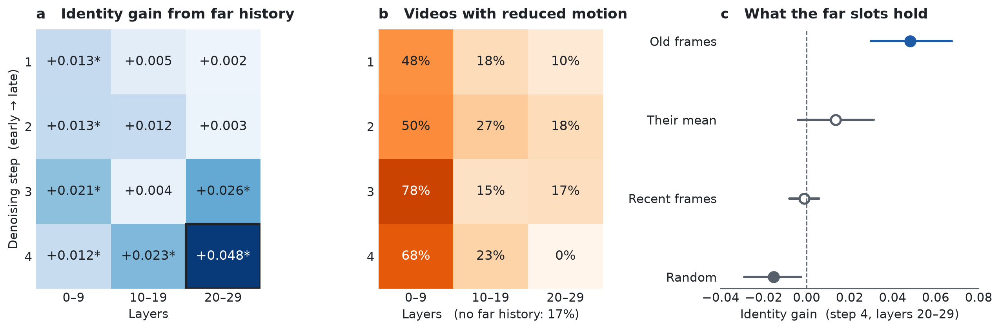

# Mechanism figure

Self-Forcing without a sink, 48 s, 20 prompts × 3 seeds. We read far history in one (denoising step, layer band) cell
at a time and measure DINOv2 identity at 38-47.5 s against the same video without far history.

- **a** Identity gain per cell; `*`: the paired 95% bootstrap interval over prompts excludes 0. The gain concentrates
  in the last denoising step and the deep layers.
- **b** Share of videos with reduced motion (late / early motion below 0.85). Far history read by shallow layers
  reduces motion at every step.
- **c** The last step × layers 20-29 with other content in the far slots: only the old frames of the video help.

`render.py` draws the figure from `summary.json`; [`analysis/read_locus/tables.py`](../../analysis/read_locus/tables.py)
recomputes every number from the per-video data. [PDF](read_locus.pdf) · [SVG](read_locus.svg)
