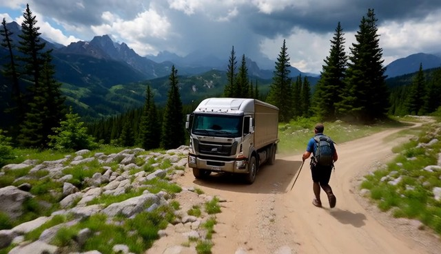
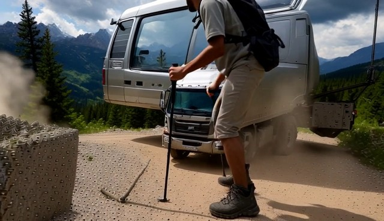
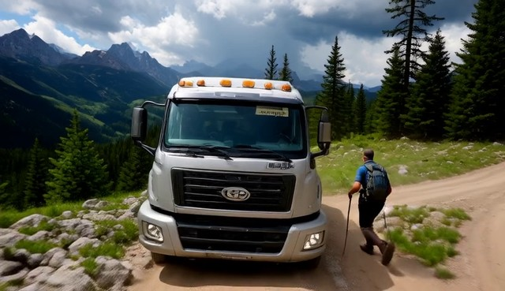
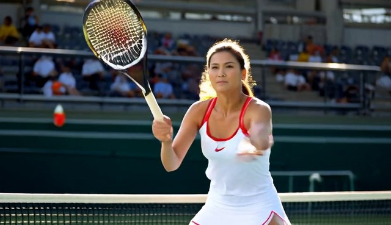
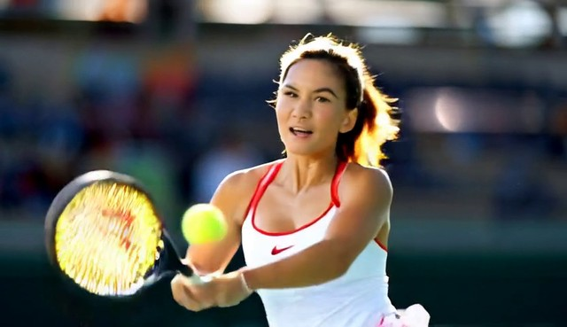
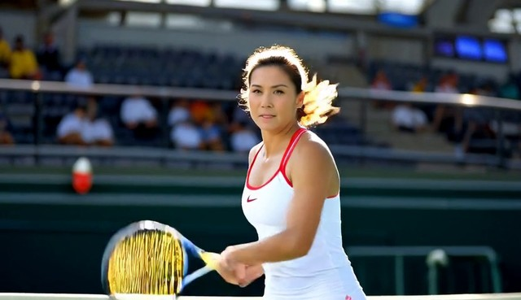
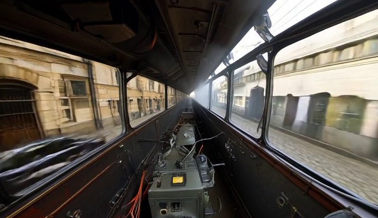
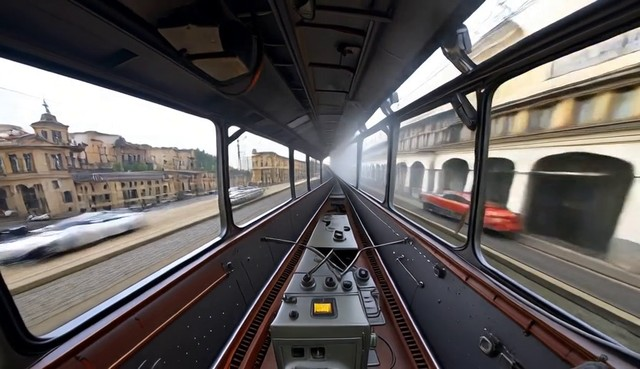

# Paired long rollouts

[← Repository home](../../README.md#qualitative-comparisons)

Each row shows one model without (Base) and with Commit Forcing, from the same prompt and initial noise. The two videos
are identical until Commit Forcing first changes a commit pass, so they share the start frame (1 s); the Base and
+ Commit Forcing frames are 2 s before the end. Each video plays the first and the last 4 seconds side by side. We
generated the SGF and SGF+ examples with the code in this repository; the others come from the runs behind our tables.

<table>
<tr><th></th><th>Start (same in both)</th><th>Base</th><th>+ Commit Forcing</th></tr>
<tr><td><b>SGF</b> 240 s MovieGen #3 <a href="sgf/comparison.mp4">video</a></td><td></td><td></td><td></td></tr>
<tr><td><b>SGF+</b> 60 s rollf200 #160 <a href="sgf-plus/comparison.mp4">video</a></td><td></td><td></td><td></td></tr>
<tr><td><b>Recency Forcing</b> 60 s rollf200 #24 <a href="recency-forcing/comparison.mp4">video</a></td><td></td><td></td><td></td></tr>
<tr><td><b>LongLive</b> 240 s ID-Forcing prompts #96 <a href="longlive/comparison.mp4">video</a></td><td></td><td></td><td></td></tr>
<tr><td><b>Context Forcing</b> 60 s rollf200 #99 <a href="context-forcing/comparison.mp4">video</a></td><td></td><td></td><td></td></tr>
<tr><td><b>Rolling Sink</b> 60 s rollf200 #102 <a href="rolling-sink/comparison.mp4">video</a></td><td></td><td></td><td></td></tr>
<tr><td><b>ID-Forcing on Self-Forcing</b> 240 s ID-Forcing prompts #79 <a href="idf-sf/comparison.mp4">video</a></td><td></td><td></td><td></td></tr>
<tr><td><b>TetherCache</b> 240 s MovieGen #19 <a href="tethercache/comparison.mp4">video</a></td><td></td><td></td><td></td></tr>
</table>

VBench-Long scores of each pair, per video: the rows of the prompt index with labels `<arm>` (Base) and `<arm>+rule`
(+ Commit Forcing), seed 0.

| Examples | Per-video scores | Arms |
|---|---|---|
| Recency Forcing, Context Forcing, Rolling Sink | [`results/vbench_long_60s.csv`](../../results/vbench_long_60s.csv) | `rf`, `context_forcing`, `rolling_sink` |
| LongLive, ID-Forcing on Self-Forcing | [`results/long_horizon/vbench_long_240s_idf128.csv`](../../results/long_horizon/vbench_long_240s_idf128.csv) | `longlive`, `idf_sf` |
| TetherCache | [`results/long_horizon/vbench_long_240s_moviegen32.csv`](../../results/long_horizon/vbench_long_240s_moviegen32.csv) | `tethercache` |

The SGF and SGF+ examples are new generations; their settings are scored in the same files (`sgf` in the 240 s MovieGen
file, `sgf_plus` in the 60 s file).
